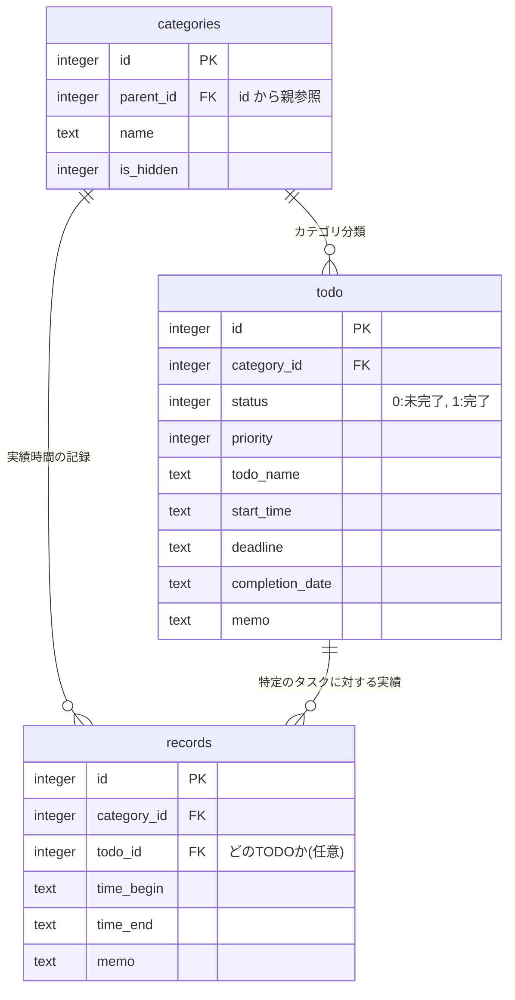

# ER

```mermaid
erDiagram
    categories ||--o{ records : "実績時間の記録"
    categories ||--o{ todo : "カテゴリ分類"
    todo ||--o{ records : "特定のタスクに対する実績"

    categories {
        integer id PK
        integer parent_id FK "id から親参照"
        text name
        integer is_hidden
    }

    records {
        integer id PK
        integer category_id FK
        integer todo_id FK "どのTODOか(任意)"
        text time_begin
        text time_end
        text memo
    }

    todo {
        integer id PK
        integer category_id FK
        integer status "0:未完了, 1:完了"
        integer priority
        text todo_name
        text start_time
        text deadline
        text completion_date
        text memo
    }
```
